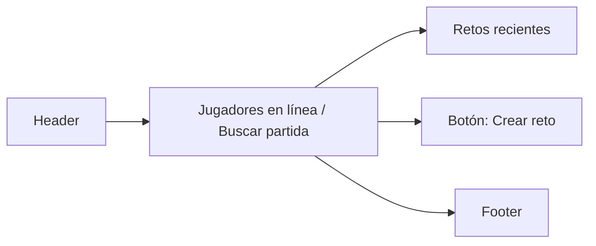

# Wireframes — Rompecabezas

Breve wireframes para las pantallas clave que involucran el `PuzzleQuestion`.

**1) Lobby / Lista de jugadores**



Descripción: área principal con lista de jugadores y retos; botón para desafiar.

**2) Pantalla de Batalla — Pregunta Rompecabezas**

```mermaid
flowchart TB
  header([Header])
  info[Player: PlayerOne | Bet: 50]
  timer((00:45))
  qbox[Pregunta: Rompecabezas]
  fragments[Fragments (drag & drop) : 6]
  submit[[Botón: Enviar]]
  footer([Indicadores: score / vida / chat])

  header --> info
  info --> timer
  timer --> qbox
  qbox --> fragments
  fragments --> submit
  submit --> footer
```

Notas:
- `fragments` representa bloques arrastrables; incluir indicador de tiempo restante y bonificaciones por rapidez.

**3) Resumen de Batalla / Resultados**

```mermaid
flowchart LR
  header2([Resultado])
  score1[PlayerOne: 120]
  score2[PlayerTwo: 95]
  rewards[Recompensas: XP, monedas]
  actions[Botones: Volver al Lobby | Revancha]

  header2 --> score1
  header2 --> score2
  score1 --> rewards
  score2 --> rewards
  rewards --> actions
```

Siguientes pasos sugeridos:
- Crear variantes del `PuzzleQuestion` para móvil (touch reorder) y accesibilidad (keyboard reorder).
- Exportar estos wireframes a PNG/SVG para uso en diseño.

Archivos añadidos:
- `docs/wireframes/puzzle-wireframes.md`
- `src/components/PuzzleQuestion.stories.jsx`

¿Quieres que configure Storybook (`npx sb init`) e inicie una vista previa local ahora? Si sí, ¿prefieres que lo haga yo aquí o solo te dé los comandos a ejecutar?  

Comandos sugeridos para probar Storybook localmente:

```bash
# instalar storybook si no está inicializado
npx sb init
# arrancar storybook
npm run storybook
# o
npx storybook dev -p 6006
```
